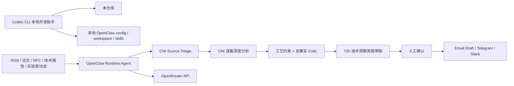

# ZYW Insight Agent — OpenClaw + Codex CLI 本地开发包

本项目是一个从零开始开发的 **技术洞察 AI Agent** 骨架，目标是：

```text
Codex CLI = 高权限本地开发助手
OpenClaw = 运行期 Gateway / Agent harness
OpenRouter = 运行期唯一模型 API provider
```

Codex CLI 可以帮助你修改本地仓库、OpenClaw config、skills、SOUL/MEMORY/AGENTS/TOOLS 等 harness 文件；但 OpenClaw agent 后续运行时 **禁止使用 Codex**，只允许通过 OpenRouter provider 调用模型。

本项目将 CNI（Constraint-aware Network Insight）方法论固化为 prompts、schemas、skills、质量闸门、预算估算与 OpenClaw runtime harness。

## 推荐架构



## 关键目录

```text
.
├── AGENTS.md                                      # Codex CLI 项目级开发指令
├── CODEX_HIGH_PRIVILEGE_OPENCLAW_RUNBOOK.md      # 高权限修改 OpenClaw 的运行手册
├── .codex/
│   ├── config.toml                                # 常规 Codex CLI 项目配置
│   ├── config.high-trust-openclaw.toml            # 可选高权限 OpenClaw 开发配置
│   └── prompts/04_high_privilege_openclaw_harness.md
├── docs/
│   ├── 08_CODEX_DEV_OPENCLAW_RUNTIME_BOUNDARY.md  # 开发期/运行期边界
│   └── 09_OPENCLAW_RUNTIME_HARNESS.md             # OpenClaw harness 说明
├── openclaw/harness/
│   ├── workspace/                                 # OpenClaw 运行期 SOUL/MEMORY/AGENTS 等
│   ├── skills/                                    # OpenClaw 运行期 skills
│   └── config/openclaw.runtime.openrouter-only.json5
├── scripts/install_openclaw_harness.sh            # 安装 harness 到 ~/.openclaw
├── src/zyw_insight/runtime_guard.py               # OpenRouter-only 边界检查
└── tests/test_runtime_guard.py
```

## 本地初始化

```bash
python -m venv .venv
source .venv/bin/activate
pip install -e .
make test
make runtime-guard
```

## Codex CLI 推荐启动方式

推荐优先使用 scoped high-permission，让 Codex 能改 `~/.openclaw`，但仍有边界：

```bash
codex \
  --sandbox workspace-write \
  --add-dir "$HOME/.openclaw" \
  --ask-for-approval on-request
```

如果你明确希望 Codex 拥有完整本地权限，请先在专用 VM、容器或隔离用户中操作，并备份：

```bash
cp -a "$HOME/.openclaw" "$HOME/.openclaw.backup.$(date +%Y%m%d-%H%M%S)" 2>/dev/null || true
codex --sandbox danger-full-access --ask-for-approval on-request
```

## 启动后给 Codex CLI 的第一条指令

```text
请读取 .codex/prompts/04_high_privilege_openclaw_harness.md 并执行。
你可以修改本仓库和 ~/.openclaw 中的 OpenClaw 配置、workspace harness、skills、memory/soul 文件。
但 OpenClaw 运行期必须只使用 OpenRouter API，不得配置或调用 Codex、Codex CLI、Codex OAuth、@openai/codex 或任何 coding-agent provider。
先列出计划修改的文件和命令，等我确认后再执行真实安装。
```

## 安装 OpenClaw runtime harness

Dry-run：

```bash
bash scripts/install_openclaw_harness.sh --dry-run
```

确认后安装：

```bash
bash scripts/install_openclaw_harness.sh
openclaw doctor
```

安装目标默认是：

```text
~/.openclaw/workspace/zyw-insight/
~/.openclaw/skills/
~/.openclaw/openclaw.zyw-insight.openrouter-only.json5
```

## 运行期边界检查

```bash
make runtime-guard
```

该检查会确认 OpenClaw runtime config：

- 至少包含 `openrouter/` 模型引用；
- 不包含 Codex runtime provider / command / OAuth；
- 不包含明显 API key；
- 不开启 `deliver: true` 自动发送。

## 人工必须填写的内容

不要让 Codex 猜测或写入这些内容：

- OpenRouter API key；
- 当前可用且价格合适的 OpenRouter explicit model ID；
- Telegram/Slack/Email token 与 allowlist；
- 预算告警地址；
- 是否从 draft-only 改为自动发送。

## CNI 方法论核心

每篇文献必须覆盖：来源可信度、快速分类、核心机制、工艺/器件/芯片/网卡/协议/网络/运维/安全/成本约束、约束依赖、较差工艺反事实、Network Impact Vector、证据质量、直接/反事实/战略洞察、评分与建议动作。

不要把系统实现成普通摘要机器人。
