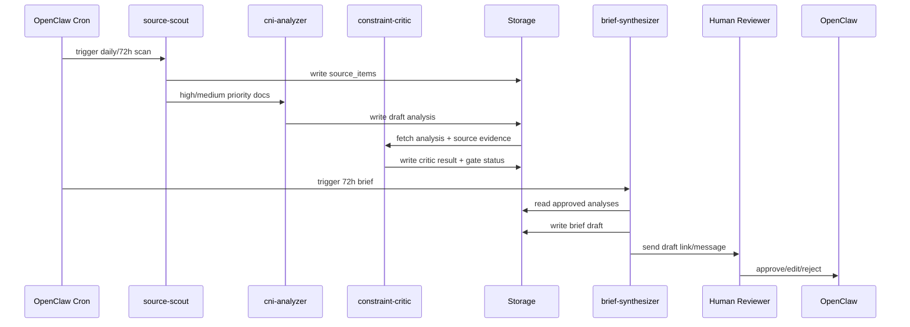

# 系统架构设计

## 1. 架构定位

OpenClaw 在本项目中承担“agent 网关层”：

- 多渠道入口：WebChat、Telegram、Slack、Email/Webhook。
- 定时任务：72h 简报 cron。
- Agent 路由：实验版单 agent，正式版多 agent。
- Skills：将 CNI 工作流暴露给 agent 使用。
- 安全控制：allowlist、sandbox、工具权限、人工确认。

CNI 分析逻辑应沉淀在本地 repo 中，而不是散落在聊天记录里。

## 2. 分层

| 层级 | 组件 | 说明 |
|---|---|---|
| Channel Layer | OpenClaw channels | Telegram/Slack/WebChat/Email draft |
| Gateway Layer | OpenClaw Gateway | sessions、cron、routing、skills、sandbox |
| Orchestration Layer | Python CLI/API | ingest、triage、analyze、critic、brief |
| Model Layer | OpenRouter + explicit model IDs | 分层路由、预算控制、fallback |
| Data Layer | SQLite/Postgres + files | source、analysis、brief、cost、audit |
| Quality Layer | schemas + gates + evals | 强制阻断低可信强结论 |
| Human Layer | reviewer | 邮件/简报发送前确认 |

## 3. 数据流



## 4. 核心对象

### 4.1 SourceItem

- id
- url / local_path
- title
- source_type
- source_rank A/B/C/D
- domain
- discovered_at
- relevance
- triage_decision
- hash

### 4.2 LiteratureAnalysis

对应 CNI 单篇文献 20 段输出：

1. 基本信息
2. 一句话结论
3. 问题背景
4. 核心思想
5. 创新点
6. 系统/协议/工艺机制
7. 工艺约束
8. 工艺约束依赖性分析
9. 较差工艺能否实现较优性能
10. 网络指标影响矩阵
11. 实验证据与可信度
12. 与已有技术对比
13. 隐含假设与风险
14. 安全与运维影响
15. 可复现性
16. 技术洞察
17. 战略意义
18. 评分
19. 建议动作
20. 后续验证实验

### 4.3 Brief

- window_start / window_end
- executive_brief
- radar
- contradictions
- process_constraint_trends
- network_metric_trends
- recommended_actions
- budget_report
- quality_report

## 5. 模型调用策略

不要让 OpenClaw 单 agent 用一个模型跑全流程。业务流程应显式拆成低价、高吞吐、长文本、critic 和终审层级。

```text
source discovery -> low cost model
triage -> low cost model
deep analysis -> long context model
constraint critic -> reasoning model
brief synthesis -> balanced high quality model
final review -> manually triggered premium model
```

## 6. 存储建议

### 实验版

- SQLite：`data/zyw_insight.sqlite`
- 原文归档：`data/sources/`
- 分析输出：`outputs/analyses/`
- 简报输出：`outputs/briefs/`

### 正式版

- Postgres：结构化记录。
- 对象存储：PDF/HTML/Markdown 原文。
- 可选向量库：只用于检索，不用于替代 provenance。
- 所有结论必须能追溯到 source + extracted evidence。

## 7. 错误处理

| 失败 | 策略 |
|---|---|
| 来源抓取失败 | 标记 `fetch_failed`，不重试超过 2 次 |
| PDF 抽取失败 | 进入人工队列 |
| schema 失败 | 尝试一次 repair，再失败则人工审核 |
| critic 阻断 | 降级建议动作，不进入强推荐 |
| 预算超 70% | 降低 reasoning，减少 critic 范围 |
| 预算超 90% | 只处理 A 级来源和人工指定文档 |
| 预算超 100% | 停止自动深读，只保留来源发现 |

## 8. 最小 API/CLI

```bash
zyw-insight ingest --url <url>
zyw-insight triage --input data/sources/*.json
zyw-insight analyze --source-id <id>
zyw-insight critic --analysis-id <id>
zyw-insight brief --window 72h
zyw-insight budget --scenario baseline_efficient
zyw-insight quality-check outputs/analyses/<id>.json
```
